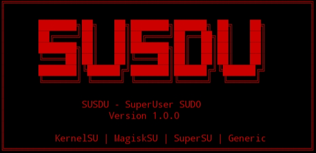
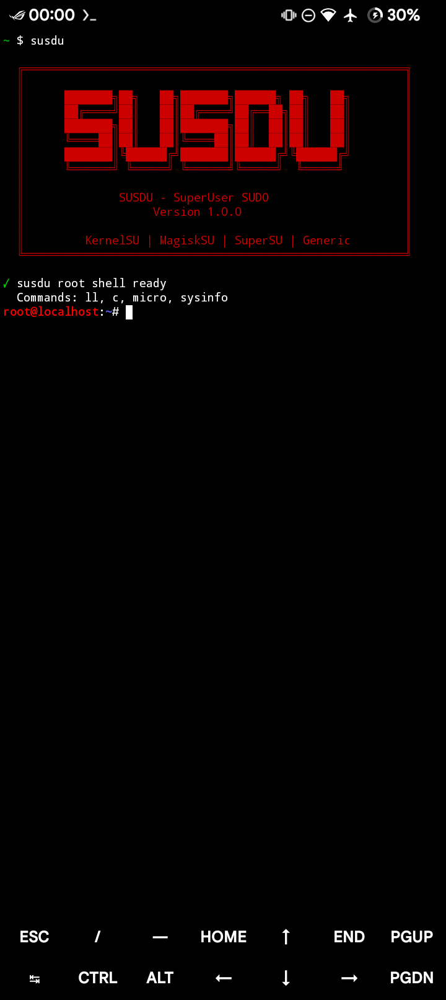
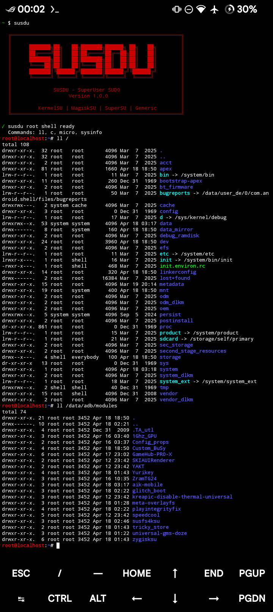

<p align="center">
  
</p>

<h1 align="center">⚡ SUSDU</h1>
<p align="center"><b>SuperUser SUDO for Termux</b></p>

*Modern root shell wrapper for KernelSU, MagiskSU, SuperSU and generic su*

[](https://opensource.org/licenses/MIT)
[](https://github.com/yourusername/susdu)
[](https://termux.com)

---

## 📖 About

SUSDU is a lightweight, secure, and modern root shell wrapper for Termux. Built as a complete replacement for legacy tools like `tsu`, it offers robust compatibility with all major Android root solutions while prioritizing safety and user experience.

**Why SUSDU?**  
- `tsu` has limited compatibility with newer root implementations (KernelSU, modern Magisk)
- SUSDU provides proper environment isolation, safe command handling, and multi-backend support

---

## ✨ Features

| Feature | Description |
|---------|-------------|
| 🔧 **Multi-Root Support** | KernelSU, MagiskSU, SuperSU, Generic su |
| 🖥️ **Interactive Shell** | Full root shell with custom `.bashrc` |
| 📝 **Single Commands** | Run any command as root |
| 🔒 **Environment Preserve** | `-E` flag preserves your environment |
| 📁 **Isolated Root HOME** | `~/.susdu/` keeps root configs separate |
| 🐚 **Custom Shell** | Choose between bash, system sh, or custom |
| 🛡️ **Secure by Design** | No `eval`, command escaping, no injection |
| 🔄 **Smart Fallback** | Automatic `su 0 -c` fallback |
| 🎨 **Beautiful Banner** | Clean ASCII art on startup |

---

## 📋 Requirements

- [Termux](https://termux.com) installed
- Root access (KernelSU, MagiskSU, or SuperSU)
- Bash shell

---

## 🚀 Installation

### Via Termux Package (Coming Soon)
```bash
pkg install susdu
```

### Manual Installation

```bash
# Download the script
curl -LO https://raw.githubusercontent.com/inrryoff/susdu/main/susdu

# Make it executable
chmod +x susdu

# Move to Termux bin
mv susdu $PREFIX/bin/

# Test it
susdu --version
```

### From Source
```bash
git clone https://github.com/inrryoff/susdu
cd susdu
chmod +x susdu
cp susdu $PREFIX/bin/
```

---

## 🎯 Usage

### Interactive Root Shell
```bash
susdu
```
You'll see the banner and get a root prompt:
```
root@localhost:~#
```

### Run Commands as Root
```bash
susdu ls -la /data
susdu -c "cat /proc/version"
```

### Use System Shell
```bash
susdu -s system getprop ro.product.model
```

### Switch to Another User
```bash
susdu -u shell whoami
```

### Preserve Environment Variables
```bash
susdu -E env
```

### Disable .bashrc Loading
```bash
susdu --no-bashrc
```

### Debug Mode
```bash
susdu --dbg
```

---

## ⚙️ Command Line Options

| Option | Description |
|--------|-------------|
| `-c, --command CMD` | Execute a command as root |
| `-s, --shell SHELL` | Use specific shell (bash, system, or path) |
| `-u, --user USER` | Switch to specified user |
| `-E, --preserve-env` | Preserve current environment |
| `-b, --bashrc` | Load .bashrc (default for interactive) |
| `--no-bashrc` | Skip loading .bashrc |
| `--dbg, --debug` | Enable debug output |
| `-h, --help` | Show help message |
| `--version` | Show version information |

---

## 📁 Root Environment

When you first run SUSDU, it automatically creates:

```
~/.susdu/
└── .bashrc          # Root shell configuration (never overwritten)
```

### Default .bashrc Includes:

**Aliases:**
```bash
ll              # ls -la
c               # clear
x               # exit
croot           # cd to root home
ctermux         # cd to Termux home
csystem         # cd to /system
cdata           # cd to /data
```

**Prompt:**
```bash
root@localhost:~#
```

**Helper Function:**
```bash
sysinfo         # Display device, Android, kernel, and root info
```

### Customizing Root Environment

Edit the `.bashrc` file directly:
```bash
susdu
conf            # Opens ~/.susdu/.bashrc in micro editor
src             # Reloads the configuration
```

---

## 🛡️ Security Features

| Feature | Implementation |
|---------|----------------|
| No `eval` | Commands are properly escaped with `printf %q` |
| No injection | Multi-word commands handled safely |
| No auto-user | User switching requires explicit `-u` flag |
| Recursion protection | Detects if already root |
| Fallback safety | Graceful fallback to `su 0 -c` |

---

## 🔄 Compatibility Matrix

| Root Solution | Interactive | Commands | Preserve Env | Fallback |
|---------------|-------------|----------|--------------|----------|
| **KernelSU** | ✅ | ✅ | ✅ (`-p`) | ✅ |
| **MagiskSU** | ✅ | ✅ | ✅ (`--preserve-environment`) | ✅ |
| **SuperSU** | ✅ | ✅ | ✅ (`-p`) | ✅ |
| **Generic su** | ✅ | ✅ | ✅ (`-p`) | ✅ |

---

## 📊 Comparison with tsu

| Feature | SUSDU | tsu |
|---------|-------|-----|
| KernelSU support | ✅ | ⚠️ Limited |
| Modern Magisk | ✅ | ⚠️ Limited |
| Safe command parsing | ✅ | ❌ |
| No eval | ✅ | ❌ |
| Isolated root HOME | ✅ | ❌ |
| Custom shell support | ✅ | ✅ |
| Environment preserve | ✅ | ✅ |
| Active maintenance | ✅ | ⚠️ Abandoned |

---

## 🐛 Troubleshooting

### "No su binary found"
- Ensure your device is properly rooted
- Check if `su` exists: `which su`
- Try: `ls -la /system/bin/su`

### "Already running as root"
- You're already in a root shell
- Type `exit` to return to normal user

### Aliases not working
- Make sure you're using interactive mode: `susdu` (not `susdu command`)
- Check if `.bashrc` loaded: `alias`
- Force reload: `src`

### Custom .bashrc not loading
- Verify file exists: `ls -la ~/.susdu/.bashrc`
- Check permissions: `chmod 644 ~/.susdu/.bashrc`

---

## 📝 Examples

### Daily Usage
```bash
# Navigate to protected directories
susdu
cd /data/data
ll

# Quick system info
susdu sysinfo

# Edit system files
susdu micro /system/build.prop
```

### Development
```bash
# Compile and run C program as root
susdu gcc -o test test.c
susdu ./test

# Check root processes
susdu ps aux | grep root

# Monitor system
susdu top
```

---

## 🤝 Contributing

Contributions are welcome! 

1. Fork the repository
2. Create your feature branch (`git checkout -b feature/amazing`)
3. Commit your changes (`git commit -m 'Add amazing feature'`)
4. Push to the branch (`git push origin feature/amazing`)
5. Open a Pull Request

---

## 📄 License

MIT License - see [LICENSE](LICENSE) file for details.

---

## 👤 Author

**Created by @inrryoff**

- GitHub: [@inrryoff](https://github.com/inrryoff)

---

## 🙏 Acknowledgments

- Termux community for inspiration
- tsu project for the original concept

---

## 📌 Roadmap

- [ ] Official Termux package (`pkg install susdu`)
- [ ] Man page (`susdu(1)`)
- [ ] Zsh support
- [ ] Test suite
- [ ] CI/CD pipeline
- [ ] Termux repository submission

---

## ⭐ Show Your Support

If you find SUSDU useful, please:
- ⭐ Star the repository on GitHub
- 📢 Share with the Termux community
- 🐛 Report issues and suggestions

---

**Made with ❤️ for the Termux community**

---

# 📸 Screenshots



---


